<!-- hero: neofetch-style info panel (ASCII portrait slot reserved below --
     add yours by running scripts/prep_photo.py + make_ascii_svg.py on a
     photo of yourself, then restore the two-column table) -->

<!-- animated contribution graph: real data, scraped directly from GitHub's
     own public page, boxes reveal cell by cell
     (regenerated daily by .github/workflows/update-profile-art.yml) -->

<h3><code>hari@github ~ $ ./contributions.sh</code></h3>

 
 

<h3><code>hari@github ~ $ whoami</code></h3>

 
 

<h3><code>hari@github ~ $ ./links.sh</code></h3>

<b>M.Sc. Data Science Student · Applied ML · Open to Werkstudent / Praktikum</b>

 

